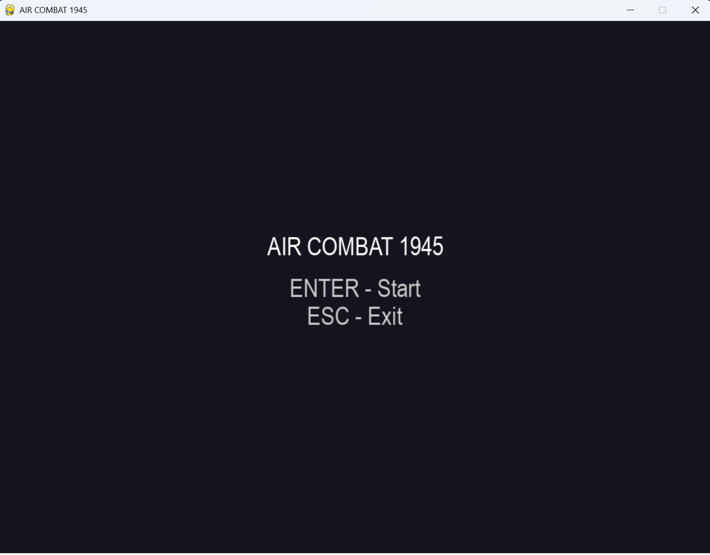
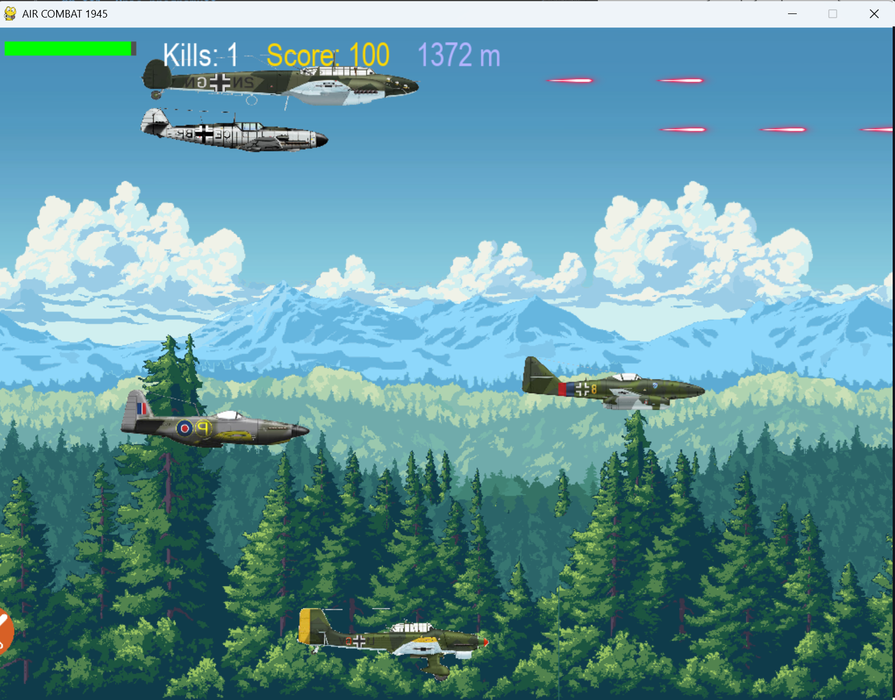

# **Air Combat 1945**

<b>Jakub Skwarczewski</b>

## **1. Opis programu**
Program to gra lotnicza inspirowana przeglądarkową grą Fighter Pilot 42   
Cel gry Air Combat:  
Gra polega poruszaniu się samolotem po planszy i strącaniu nadlatujących przeciwników, przy jednoczesnym unikaniu ostrzału z ich strony. Celem gry jest osiągnięcie jak największego wyniku, jak największej ilości zestrzeleń i jak największej pokonanej odległości. W czasie gry oprócz samolotów przeciwnika w sposób losowy generowane są pakiety naprawcze umożliwiające naprawę samolotu. 

Link do gry stanowiącej inspirację dla projektu: https://www.gameflare.com/online-game/fighter-patrol-42/

----------
## **2. Opis interfejsu**
Program składa się z ekranu startowego oraz właściwego ekranu gry.  
Ekran startowy wyświetla tytuł oraz możliwe do wyboru opcje - start oraz wyjście. Obok możliwych opcji napisane są klawisze, które należy wcisnąć by wybrać daną opcję. 

Ekran menu: 

 
Ekran gry pozwala na poruszanie samolotem na planszy. Na samej górze mamy ukazany pasek zdrowia oraz statystki - liczbę zestrzeleń, przebytą odległość oraz liczbę punktów uzyskanych za wszystkie zestrzelenia.  
Aby poruszać się samolotem należy używać klawiszy wsad. Klawisze 'w' i 's' służą do zmiany pułapu samolotu (odpowiednik poruszania się po osi Y w kartezjańskim układzie współrzędnych). Klawisz 'd' służy do zwiększania prędkości samolotu, natomiast klawisz 'a' do zwalniania. By oddać strzał należy przycisnąć spację, można ją również przytrzymać by strzelać serią. By zapauzować rozgrywkę należy wcisnąć przycisk 'p'  

Ekran gry:  

----------

## **3. Implementacja**
Gra została zaimplementowane przy użyciu biblioteki [PyGame](https://www.pygame.org/news).
Aplikacja jest podzielona 13 modułów (plików):
* `assets.py` – plik odpowiedzialny za wczytywanie assetów do gry
* `background.py` – plik odpowiedzialny za obsługę tła w grze
* `collision.py` – plik odpowiedzialny za kolizje samolotów z pociskami
* `enemy.py` – plik odpowiedzialny za funkcje dotyczące przeciwników, ich poruszanie się i strzelanie
* `enemyBullets.py` – plik odpowiedzialny za pociski wystrzelone przez przeciwników
* `enemySpawn.py` – plik odpowiedzialny za tworzenie przeciwników na ekranie
* `enemyTypes.py` – plik odpowiedzialny za wczytywanie rodzajów przeciwników występujących w grze
* `explosion.py` – plik odpowiedzialny za animacje eksplozji
* `gameConst.py` – plik zawierający zmienne wykorzystywane w grze
* `Gra.py` – główny plik, w nim znajduje się pętla z grą
* `healing.py` – plik odpowiedzialny za obsługę zestawów naprawczych (regeneracja HP)
* `hud.py` – plik odpowiedzialny za tworzenie interfejsu w grze
* `player.py` – plik odpowiedzialny za funkcje dotyczące gracza (poruszanie, strzelanie)
---
### `assets.py`
Zawiera trzy funkcje:
- `load_image(path, size=None)` – wczytywanie obrazów (assetów)
- `load_explosions()` – wczytywanie animacji eksplozji
- `load_music()` – ładowanie muzyki grającej w tle
---
### `background.py`
Moduł zawiera klasę **Parallax** oraz funkcję `create_parallax()`.

**Parallax**  
Klasa tworząca paralaksę w tle, umożliwiająca przewijanie tła.  
Zawiera dwie metody:
- `update()` – odpowiada za przewijanie paralaksy
- `draw()` – wyświetla paralaksę na ekranie

`create_parallax()`  
Funkcja służąca do wczytywania poszczególnych warstw tła i nadawania im indywidualnej prędkości przewijania.

---
### `collision.py`
Zawiera dwie funkcje służące do wykrywania kolizji pomiędzy pociskami a samolotami:
- `player_hit_by_enemy_bullets(player, enemy_bullets)`  
  Sprawdza za pomocą prostokątnych colliderów z biblioteki **pygame**, czy któryś z pocisków przeciwnika trafił gracza.  
  Zwraca `true` w przypadku kolizji lub `false` w przeciwnym przypadku.
- `enemies_hit_by_player(enemies, player, explosions, now, stats)`  
  W przypadku kolizji obniża punkty życia przeciwnika.  
  Po ich wyzerowaniu tworzona jest animacja eksplozji, przeciwnik zostaje usunięty, a statystyki gry są aktualizowane.

---
### `enemy.py`
Zawiera klasę **Enemy**, w której deklarowane są statystyki przeciwników, ich pozycje startowe oraz logika poruszania się i strzelania.

Metody klasy:
- `update(self, player_speed, screen_height)` – aktualizacja ruchu przeciwnika
- `try_shoot(self, enemy_bullets, bullet_img, now)` – obsługa strzelania przez przeciwnika, wywołuje:
  - `shoot_front(self, enemy_bullets, bullet_img, now)` – strzelanie do przodu
  - `shoot_rear(self, enemy_bullets, bullet_img, now)` – strzelanie przez tylnego strzelca
  - `shoot_bottom_rear(self, enemy_bullets, bullet_img, now)` – strzelanie przez dolnego strzelca bombowca **He-111**
- `is_offscreen(self, width, margin=400)` – sprawdza, czy przeciwnik znajduje się poza ekranem

Oprócz tego moduł zawiera następujące funkcje:
- `update_enemies(enemies, player_speed, screen_height, width, enemy_bullets, enemy_bullet_img, now)`  
  Aktualizuje przeciwników, obsługuje ich strzelanie i usuwa obiekty poza ekranem.
- `draw_enemies(screen, enemies)` – rysuje przeciwników na ekranie
----------
### `enemyBullets.py`
Moduł zawiera dwie funkcje:
- `update_enemy_bullets(enemy_bullets, player_speed)` – aktualizuje pozycje pocisków przeciwnika na ekranie
- `draw_enemy_bullets(screen, bullets, bullet_img)` – rysuje pociski przeciwnika na ekranie przy użyciu metody `blit` z biblioteki **pygame**
---
### `enemySpawn.py`
Moduł zawiera jedną funkcję:
- `spawn_enemy(enemies, enemy_types)` – losuje typ przeciwnika (z uwzględnieniem wag) oraz stronę ekranu, z której zostanie on utworzony, a następnie tworzy obiekt przeciwnika na podstawie danych ze słownika i dodaje go do listy aktywnych przeciwników
---
### `enemyTypes.py`
Moduł zawiera jedną funkcję:
- `load_enemy_types()` – tworzy słownik zawierający wszystkie typy samolotów przeciwnika wraz z ich statystykami oraz przypisanymi grafikami
---
### `explosion.py`
Moduł zawiera dwie funkcje służące do obsługi eksplozji:
- `update_explosions(explosions, frames, now)` – aktualizuje animacje eksplozji na ekranie
- `draw_explosions(screen, explosions, frames)` – rysuje eksplozje na ekranie
---
### `gameConst.py`
Moduł zawiera stałe oraz zmienne wykorzystywane w całym programie.  
Zostały one wydzielone do osobnego pliku w celu ułatwienia zarządzania wartościami oraz ich szybkiej modyfikacji w razie potrzeby.

---
### `Gra.py`
Główny plik gry.  
Na początku znajdują się importy funkcji z pozostałych modułów, inicjalizacja stanów gry, list (przeciwnicy, pociski gracza, pociski przeciwników, eksplozje oraz zestawy naprawcze), zmienne globalne do przechowywania wyników oraz funkcja `reset_game()`.

Następnie stan gry ustawiany jest na **Menu** oraz inicjalizowana jest biblioteka **pygame**, w tym moduły odpowiedzialne za czcionki, muzykę oraz główne okno gry.  
Kolejnym krokiem jest wczytanie niezbędnych danych (część z nich poprzez wywołanie odpowiednich funkcji).

Po wykonaniu inicjalizacji uruchamiana jest główna pętla gry.  
Pętla zdarzeń obsługuje działanie gry w zależności od aktualnego stanu oraz wciśniętych klawiszy. Na tej podstawie wywoływane są odpowiednie funkcje lub następuje przejście pomiędzy stanami gry.

Po zamknięciu programu następuje wyjście z biblioteki **pygame**, a funkcja `sys.exit()` kończy działanie programu.

---
### `healing.py`
Moduł zawiera funkcje związane z obsługą zestawów naprawczych, wykorzystywanych do regeneracji zdrowia gracza:
- `spawn_heal(heals, heal_img, distance, next_heal_distance)` – generuje pakiety naprawcze co 200–300 metrów przebytej odległości
- `update_heals(heals, player, heal_img, screen)` – aktualizuje zestawy naprawcze na ekranie
---
### `hud.py`
Moduł zawiera funkcje odpowiedzialne za rysowanie interfejsu użytkownika:
- `draw_hud(screen, font, player, stats, distance)` – rysuje interfejs podczas gry (wynik, pasek życia, dystans)
- `draw_menu(screen, font)` – rysuje menu główne
- `draw_game_over(screen, font, stats, distance)` – rysuje ekran końcowy z wynikami gry

---

### `player.py`
Moduł zawiera klasę **Player**, odpowiedzialną za obsługę logiki gracza.

Metody klasy:
- `reset(self)` – resetuje statystyki gracza przy rozpoczęciu nowej gry
- `update(self, keys)` – aktualizuje pozycję samolotu gracza na ekranie
- `shoot(self, bullet_img, shooting)` – obsługuje strzelanie gracza
- `update_bullets(self, screen, bullet_img)` – aktualizuje pociski wystrzelone przez gracza
- `draw_bullets(self, screen, bullet_img)` – rysuje pociski gracza na ekranie

----------

## **4. Sposób uruchomienia oraz obsługa**
Zalecaną opcją jest otworzenie projektu w środowisku PyCharm i uruchominie za pomocą przycisku Run.  
Możliwe jest również otworzenie w terminalu folderu z grą, a następnie wpisanie w terminalu polecenia:
`python3 Gra.py` 

----------
## **5. Literatura i pomoce**
https://www.pygame.org/docs/  
https://www.geeksforgeeks.org/python/pygame-tutorial/

Wykorzystana muzyka:
https://www.youtube.com/watch?v=ER8Ouf62kOo

----------
## **6. Wymagania**
**Python** - testowane na wersji **3.13**
**PyGame** - testowane na wersji **2.6.1**
Opcjonalnie:
**Środowisko PyCharm**
